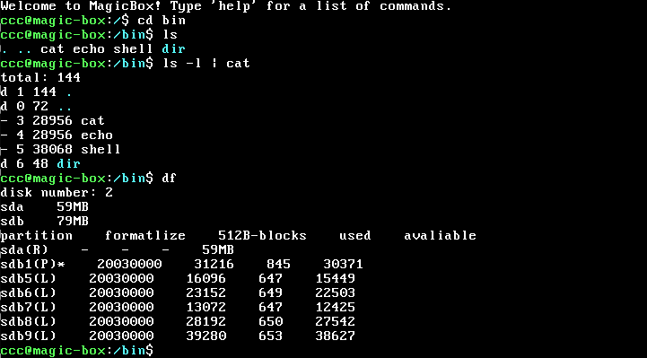

# MagicBox

**MagicBox** is an early-stage 32-bit x86 operating system prototype. This project serves as a personal practice work to explore the fundamental principles of operating systems, based on classic textbooks and community implementations. It replicates the core pipeline from initial bootloading to a basic user-mode environment.

> **Note**: This project is intended for learning purposes only, utilizing the traditional 32-bit Protected Mode tech stack.



## 📚 Learning Objectives

- **Bootstrapping & Environment**: Implemented a minimal MBR and Loader to handle the transition from Real Mode to 32-bit Protected Mode, along with an initial implementation of basic paging.
- **Minimalist Process Model**: Explored Unix-style process lifecycle management by replicating core system calls such as `fork()` and `execv()`.
- **Experimental App Deployment**: To simplify the deployment process, a simple **Tar-based** archiving mechanism was implemented. Binaries are written to raw disk sectors and extracted by the kernel into the file system during boot.
- **Basic Interaction**: Developed a rudimentary command-line Shell that supports internal commands and simple path resolution for external programs (e.g., searching in `/bin`).


## 🛠 Technical Overview

- **Interrupts & Synchronization**: Utilizes the **8259A PIC** to handle hardware interrupts. Kernel-level thread synchronization is managed through **mutexes and semaphores**, ensuring safe access to critical sections such as disk I/O operations and process lists.

- **Memory Management: Hybrid Dual-Track Architecture**

  This project implements a practical hybrid memory management system, balancing the deterministic needs of the kernel with the flexibility required by user-level processes:

  - **Physical Layer (Buddy System):** The physical memory is managed by a **Buddy System allocator** (`buddy.c`), replacing legacy bitmaps. By supporting power-of-two block allocation and merging, the system can now manage up to **3GB of RAM**, effectively overcoming the previous 128MB limitation.
  - **Kernel Virtual Space (Bitmap-based):** For the kernel virtual address space (3GB–4GB), the system continues to use a **Static Bitmap allocator**.
    - **Design Choice:** This ensures immediate and deterministic mapping for critical kernel tasks, avoiding the complexity of VMA tracking in the kernel and preventing potential reentrancy/deadlock issues during early memory allocation.
  - **User Virtual Space (VMA Framework):** The user-level address space has been refactored to use a **VMA (Virtual Memory Area) framework**, decoupling it from the old bitmap-based management.
    - **Demand Paging:** Supports lazy loading for ELF segments, heap, and stack. Physical pages are only allocated and mapped when a Page Fault is triggered by actual access.
    - **Dynamic Management:** Supports VMA splitting, merging, and gap searching, providing the necessary infrastructure for `sys_brk` heap scaling and Copy-On-Write (COW) during `fork()` and `execv()`.
  - **Small Object Allocation:** An **Arena allocator** remains integrated on top of the Buddy System to handle micro-allocations (2B–1024B) efficiently, reducing internal fragmentation for small data structures.

- **VFS Implementation & "Everything is a File" Philosophy**

  This project implements a **Virtual File System (VFS)** layer, which attempts to provide a unified interface for hardware access, inter-process communication, and disk storage.

  - **Multi-Filesystem Support**: Uses a function-pointer dispatch design. By implementing `struct super_operations`, `inode_operations`, and `file_operations`, the VFS isolates specific filesystem logic. Currently, it supports both a custom **SIFS** (Simple Index FS) and the **Ext2** specification, allowing different partitions to run different filesystems concurrently.
  - **Mount Mechanism (Mount/Umount)**: Provides basic mounting functionality. By introducing "tunneling" pointers (`i_mount` / `i_mount_at`) within the `struct inode`, the path resolution logic can traverse partition boundaries, supporting nested mount points.
  - **Dynamic I/O Dispatching**: System calls (such as `read`, `write`, and `ioctl`) bind to specific operation sets during the file-opening phase based on the Inode type, reducing the need for hardcoded type-checking:
    - **Files & Directories**: Data block addressing and metadata I/O are handled by the specific Ext2 or SIFS drivers.
    - **Inter-Process Communication (IPC)**: Anonymous pipes and named pipes (FIFOs) are integrated into the standard file descriptor (FD) management logic.
    - **Device Management**: Character devices (TTY/UART) and block devices (IDE disks) are mapped as file nodes, accessible via the unified FD interface.
  - **Metadata Management**: Maintains a global **Inode Hash Table** as a memory cache to ensure the uniqueness of Inode instances. This supports basic features like path backtracking (`getcwd`) and file renaming (`rename`), while ensuring cache consistency during deletion operations like `unlink`.

- **Task Scheduling**: Implements a **Round-Robin** scheduling algorithm. In a design reminiscent of Linux 0.12, a task's `priority` directly determines its allocated clock **ticks**. The system decrements the current task's remaining time slice during timer interrupts, triggering a reschedule only when ticks are exhausted. This non-preemptive approach maintains simplicity while distributing CPU time based on task priority.

- **Signal System**: Provides a basic signal subsystem (supporting `SIGINT`, `SIGKILL`, `SIGCHLD`, `SIGSEGV`, etc.). By manually constructing **user-mode stack frames** within the kernel, the system enables "upcalls" to user-defined handlers. Execution context is restored via `sys_sigreturn`, allowing for custom signal handling logic.

- **Resource Recovery**: Implements a two-stage resource reclamation logic. `sys_exit` releases immediate process-private resources (such as FDs), while the destruction of core structures like page directories and kernel stacks is deferred to the parent process during `wait`/`waitpid`. This ensures stable process state synchronization and memory safety.

------

## 📞 System Calls

**Task Management:**

- `fork()`: Creates a child process utilizing Copy-On-Write (COW).
- `execv()`: Parses ELF files and registers VMAs to support on-demand loading.
- `waitpid()` / `exit()`: Handles process lifecycle synchronization and resource recycling.
- `setpgid()` / `getpgid()`: Provides basic process group management for shell job control.
- `alarm()` / `pause()`: Supports simple timed signal delivery and process suspension.

**File System & IPC:**

- `open()`, `read()`, `write()`, `close()`: POSIX-like file operations.

- `mount()` / `umount()`: Implements UNIX-like VFS mounting/unmounting, establishing "tunnels" between parent directories and child partition roots.

- `pipe()`: Creates Linux-style anonymous pipes for parent-child communication.
- `mkfifo()`: Creates persistent named pipe nodes in the file system for unrelated process IPC.
- `mknod()`: Supports the creation of special files or device nodes (e.g., in `/dev`).
- `dup2()`: Handles file descriptor redirection, essential for shell pipe implementation.
- `ioctl()`: A simple device control interface, such as managing TTY foreground groups.

**Signal Handling:**

- `sigaction()` / `signal()` : Registers signal handlers and configures signal blocking masks.
- `kill()`: Dispatches signals to specific processes or process groups.
- `sigprocmask()` / `sigpending()`: Manages the signal blocking state of a process.
- `sys_sigreturn()`: (Internal) Facilitates the return from user-mode handlers to the kernel.

**Memory Management:**

- `malloc()` / `free()`: User-space heap management based on the kernel's Arena allocator.
- `brk()`: (Stub) A placeholder for future fine-grained heap boundary control.

**Storage & Recovery :**

- ~~readraw()~~ : *(Deprecated)* Previously used for raw sector access; now superseded by the unified device-file interface, aligning with the "Everything is a File" philosophy.
- `open("/dev/...", ...)`: Replaces legacy disk access. All block devices (e.g., `sda`, `sdb1`) are abstracted as files, enabling user-space tools like `mkfs` and `hexdump` to operate via standard I/O calls.  
  - *Example*: `open("/dev/sda", O_RDONLY)` now provides raw disk access, enabling user-space tools like `mkfs` and `hexdump` to operate via standard POSIX I/O without extra kernel support.


## 📂 Project Structure

The project follows a modular design, separating kernel core logic, hardware drivers, and user-space applications. Below is an overview of the directory hierarchy:

```
.
├── boot/               # MBR & Kernel Loader (System bootup and entry to protected mode)
├── device/             # Hardware Drivers (Keyboard, IDE, Disk Buffer, TTY, and IOCTL)
├── fs/                 # File System Layer (VFS, File Table, Pipes, and SIFS implementation)
│   ├── ext2/           # Ext2 Specific Operations (Super, Inode and File operations)
│   ├── sifs/           # SIFS Specific Operations (Super, Inode and File operations)
│   └── *.c           	# Operations for VFS
├── include/            # Header Files (Organized by subsystem and access level)
│   ├── arch/           # Architecture-related (Hardware I/O and low-level print)
│   ├── magicbox/       # Kernel Private Headers (Memory, Threads, FS, and Sync)
│   ├── sys/            # Standard C Headers (stdint, string, stdio, etc.)
│   └── uapi/           # User-Kernel Interface (SIFS layout, IOCTL codes, and unistd)
├── kernel/             # Kernel Core (Interrupts, Initialization, and Signal handling)
├── lib/                # Library routines
│   ├── kernel/         # Kernel-mode libraries (Bitmap, DList, Hashtable)
│   └── user/           # User-mode system call wrappers
├── mm/                 # Memory Management (Buddy System, VMA, Arena Allocator and Page tables)
├── prog/               # User-land applications
│   ├── shell/          # Interactive Shell implementation
│   └── prog/           # Core utilities (cat, echo, hexdump, and pipe tests)
├── thread/             # Threading & Sync (Mutex, Semaphores, and Scheduler)
├── userprog/           # Process Management (Exec, Fork, Wait/Exit, and TSS)
├── tool/               # Development Tools (GDB scripts and Address-to-line scripts)
├── disk_env/           # Hard disk images (hd60M and hd80M)
├── doc/                # Documentation and preview images
├── build/              # Binary artifacts and object files
├── makefile            # Master build script
├── init_disk.sh        # Disk image & partition setup script
└── install_apps.sh     # User app deployment script (Tar-based)
```


## 🚀 How to Run

### 1. Prerequisites

Ensure you have the following tools installed on your Linux system:

- **QEMU**: The emulator used to run the OS.
- **fdisk**: Used by the scripts to partition the virtual hard disk.
- **GCC & NASM**: To compile the C and Assembly source code.

### 2. Environment Setup & Build

Follow these steps in the project root directory:

(1) **Initialize the virtual disk environment** (create images and partitions in the `./disk_env` directory)

```shell
sh init_disk.sh
```

(2) By default, the build process does not format the disk. The kernel will automatically initialize a **SIFS** partition upon the first boot. Alternatively, you can pre-format the disk as **Ext2**:

```shell
# Option A: Standard build (No host-side formatting)
# The kernel will detect the missing filesystem at boot and 
# automatically initialize a SIFS partition.
make all

# Option B: Pre-format the root partition as Ext2
# This uses the host's mkfs.ext2 tool to prepare the image.
make all EXT2=1
```

*Note: Using `EXT2=1` requires `sudo` privileges on the host for `losetup` and `mkfs.ext2` operations.*

(3) **Install User Applications** Compile and deploy shell utilities into the disk image:

```shell
sh install_apps.sh
```

### 3. Launching the OS

Navigate to the `disk_env/` directory. You can choose between a standard run or a high-fidelity hardware simulation.

#### **Standard Run**

```bash
qemu-system-i386 \
  -m 32 \
  -drive file=hd60M.img,format=raw,index=0,media=disk \
  -drive file=hd80M.img,format=raw,index=1,media=disk
```

If you want to use the third disk `sdc`, try:

```shell
qemu-system-i386 \
  -m 32 \
  -drive file=hd60M.img,format=raw,index=0,media=disk \
  -drive file=hd80M.img,format=raw,index=1,media=disk \
  -drive file=hd20M_share.img,format=raw,index=2,media=disk
```

#### **Hardware Simulation Mode**

To better simulate real hardware behavior (including sync disk I/O and precise clocking), use the following:

```bash
qemu-system-i386 \
  -m 32 \
  -drive file=hd60M.img,format=raw,index=0,media=disk,cache=directsync \
  -drive file=hd80M.img,format=raw,index=1,media=disk,cache=directsync \
  -rtc base=localtime,clock=vm \
  -icount shift=auto,sleep=on \
  -boot c
```

> **Note**:
>
> - `hd60M.img`: Contains the MBR, Loader, and the Kernel.
> - `hd80M.img` / `hd20M_share.img` : Secondary data disks. To use the partitions within these disks, they must be initialized (via `mkfs.sifs` or `mkfs.ext2`) and then attached to the VFS tree using the `mount` command.


**Memory Support:** Thanks to the newly implemented **Buddy System**, the `-m` parameter now supports up to **3072** (3GB), which is the theoretical limit for physical RAM in 32-bit x86 systems (approaching the PCI/MMIO hole).


